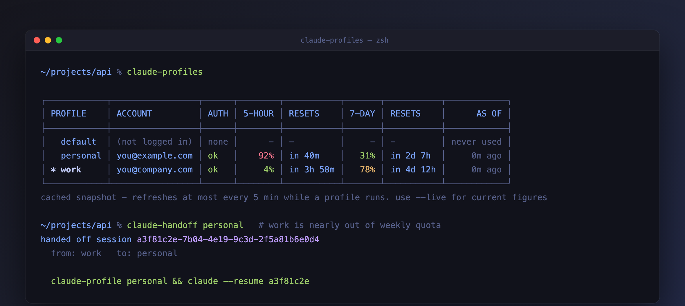

# Usage and limits

Every account has two limits running on separate clocks: a rolling **5-hour**
one and a **7-day** one. An account can be fine on one and nearly out on the
other, so both are always shown.

---

## Seeing usage

```sh
claude-profiles            # cached, instant
claude-profiles --live     # current figures
```



The example above shows the situation this tool exists for: `work` has plenty
of its 5-hour limit left but is 78% through its week, while `personal` is the
other way round. Neither number alone would tell you which account to use.

### Live figures

```sh
claude-profiles --live
```

Fetches each signed-in profile's current usage directly, in parallel, and shows
`live` in the `AS OF` column. This costs **no model tokens** - it reads a usage
endpoint, it does not run a prompt.

Any profile whose fetch fails falls back to its cached snapshot **and says
why** in the `AS OF` column, so the table always renders:

| Shown | Meaning |
|---|---|
| `live` | fetched just now |
| `14h ago (token expired)` | the access token has aged out - see below |
| `14h ago (rate limited)` | the usage endpoint returned 429; try again shortly |
| `14h ago (unreachable)` | no network, or the request timed out |
| `14h ago (not logged in)` | no credentials for that profile |

### Expired tokens

Access tokens are short-lived - roughly half a day - and Claude Code refreshes
them whenever it runs. A profile you have not used since its token aged out
returns 401, so `--live` reports `token expired` and falls back.

Open a session under that profile and the token refreshes:

```sh
claude-profile work
claude       # any session refreshes it
```

!!! note "Why this tool does not refresh tokens itself"
    It could, using the stored refresh token. But refresh tokens can change each
    time they are used, and writing a new one back could put Claude Code's own
    copy out of step. Reporting the problem is safer than competing with Claude
    Code over credentials.

`claude-doctor` also warns about expired tokens, so you can spot them before
they surprise you.

!!! note "What this sends, and where"
    `--live` reads that profile's token from your Keychain on macOS, or from its
    `.credentials.json` elsewhere. It sends that token to `api.anthropic.com` -
    the same host Claude Code already uses. Nothing goes anywhere else.

!!! warning "Unofficial endpoint"
    The usage endpoint is internal to Claude Code and is not a documented public
    API. It may change or disappear in any release, which is why the cache
    remains the default and `--live` degrades to it rather than failing.

!!! tip "A live fetch is remembered"
    `--live` saves what it fetched next to the profile. A plain `claude-profiles`
    straight afterwards shows those same figures as `0m ago`, instead of falling
    back to a much older snapshot.

### Why the cache is stale


!!! warning "Read the AS OF column"
    Without `--live`, figures come from whichever cache is newer.

    Claude Code writes one, but only while **that profile is running**, and no
    more than once every five minutes. `--live` writes the other. A profile you
    have not used today shows figures from whenever you last used it. A profile you have not used today shows figures from whenever you
    last used it; one that has never run shows `never used`.

The `AS OF` value turns amber once the snapshot is more than a day old.

The cache stays the default because it is instant and needs no network. Reach
for `--live` when the numbers actually matter - deciding which account to start
a long session on, for instance.

Two accounts showing `ok` at once is normal and expected - that is the whole
point. See [How it works](../internals/index.md) for where credentials live per OS.

---

---

## `claude-best`

Names the signed-in account with the most headroom.

```
  -> work         5% used  (5h 5%, 7d 2%)
     client      32% used  (5h 32%, 7d 17%)
```

A profile is judged by its **tightest** limit, not its average.

An account at 1% for the next five hours but 95% through its week is nearly out.
It is ranked accordingly. Accounts that are locked out or not signed in are skipped.

| Flag | Effect |
|---|---|
| `-q`, `--quiet` | print just the name, for scripting |
| `--cached` | skip the live fetch and use cached figures |

Fetches live by default, so it reflects reality rather than a stale snapshot.

---

---

## `claude-auto`

Launch Claude on whichever account has the most headroom, without choosing
yourself.

```sh
claude-auto                       # interactive session on the best account
claude-auto -p "explain this bug"
```

It resolves `claude-best --quiet`, reports the choice on stderr, then runs
`claude` under that profile via `claude-profile-exec` - so your shell's own
profile is unchanged.

!!! tip "When to use which"
    Use `claude-profile` when the account matters (client work, a specific
    subscription). Use `claude-auto` when it does not and you just want
    capacity.

---
