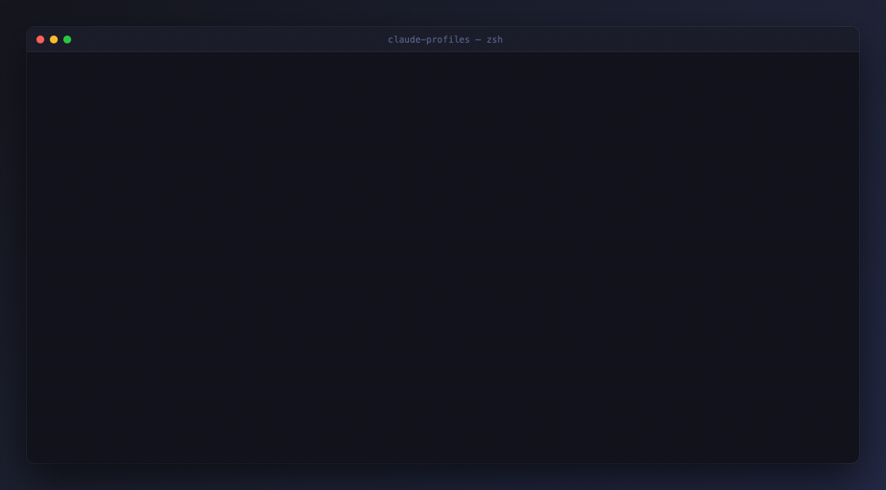

# Session handoff

**What it does, simply:** it copies a conversation from one account to another,
so you can keep going when the first account runs out.

## The problem

You are 50 messages into a conversation. Claude knows your whole problem. Then:

!!! failure "You've hit your usage limit."

Your other account has capacity. But Claude Code cannot see this conversation
from there - each account keeps its own separate history.

## The fix

```sh
claude-handoff work
```

That copies the current conversation into the `work` account's history and
prints the command to continue it:

```
handed off session 0a9014e8-8806-43cf-98fd-28fad1353923
  from: default   to: work
  dir : ~/projects/<project-name>/api

  claude-profile work && claude --resume 0a9014e8-8806-43cf-98fd-28fad1353923
```



Run that, and you are back in the same conversation with the same memory - on a
different account with its own quota.

!!! quote "Analogy"
    Like forwarding an email thread to your other address. The thread is
    identical; only the mailbox changed.

## What it does not do

- **Does not move anything.** It is a copy - the original account keeps its version, so you can switch back.
- **Does not touch your code.** Same project folder, same files, same git branch.
- **Does not transfer your limit.** That is the point: the other account has its own quota.

## One catch

Run it from the folder you were working in. It finds the conversation by which
folder it belongs to.

```sh
cd ~/projects/<project-name>/api
claude-handoff work
```

If you are somewhere else, point at the directory explicitly:

```sh
claude-handoff work -d ~/projects/<project-name>/api
```

## Picking a specific conversation

By default it takes the most recent one. To choose, list them first:

```sh
claude-sessions
```

```
   WHEN      TURNS  SESSION ID                            SUMMARY
 1 2m ago       18  eb82f424-4aff-43eb-a0e1-f1e130553fc6  refactor the auth middleware…
 2 Sep 11        2  2c24a68b-8411-4bb6-9072-99b86b5ae909  cant able to take pull
```

Then pass the id - a prefix is enough:

```sh
claude-handoff work 2c24a68b
```

An ambiguous prefix lists the candidates rather than guessing.

## What actually gets copied

```
~/.claude/projects/<encoded-dir>/<session-id>.jsonl
        |  copy, preserving the encoded directory name
        v
~/.claude-profiles/work/projects/<encoded-dir>/<session-id>.jsonl
```

Only the profile root changes. The file is byte-for-byte identical, so every
working directory recorded inside it still points at the original project.

`claude --resume` only looks inside the active profile's `projects/` directory.
That is exactly why handoff is needed - the other account is not hiding the
conversation, it genuinely cannot see the file.

!!! note "Cost"
    Resuming re-sends the conversation to the new account, so its first turn is
    a cold prompt cache and costs more tokens than an ordinary continuation.

## Handing it back

```sh
claude-handoff default
```

Works in either direction. Both copies persist independently from the moment
they diverge.
